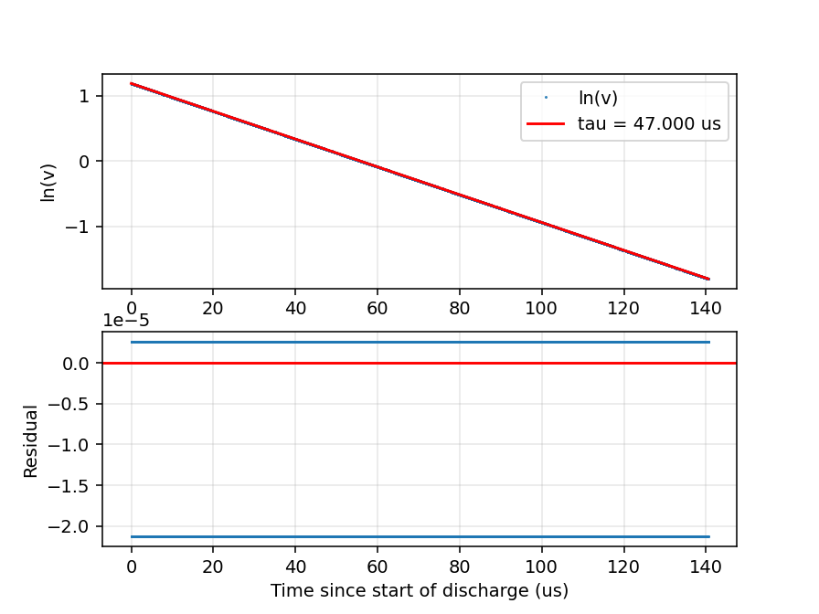
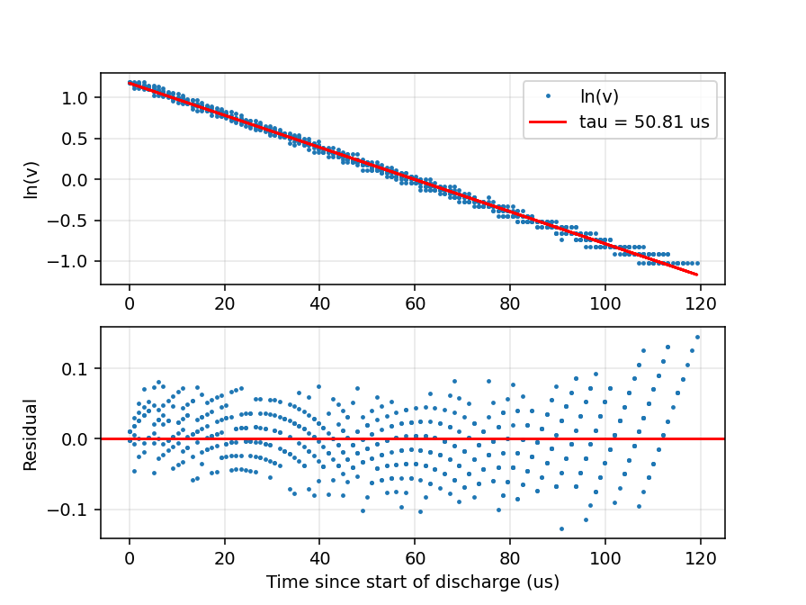

# RC Circuit Time Constant Experiment

## 1. Objective

To learn how to measure the exponential behaviour of an RC circuit, to determine the time constant `τ = RC` by several independent methods — a numerical simulation, an oscilloscope cursor reading, and two different fits to the captured waveform — to check whether the results agree, and to carry out an error analysis.

## 2. Theory

**PWM (pulse width modulation).** A method in which a pin is switched on and off at a fixed frequency. The duty cycle states what percentage of one period the pin is high (i.e. at `3.28 V`). Since `duty = 0.5` was chosen, the high and low intervals are equal, so the signal is a symmetric square wave. On the Pico this is done by hardware counters (the `pwmio` module), so it is unaffected by software delays and its timing comes from the crystal oscillator on the board. For this reason no separate signal generator was needed.

**Period (T) and frequency (f).** A square wave is a signal that switches abruptly between two levels (here `0 V` and `3.28 V`). The period is the duration of one full repetition; the frequency is the number of repetitions per second, measured in hertz (Hz):

$$f = \frac{1}{T}$$

For `f = 2 kHz`, `T = 500 µs` and the half period is `250 µs`. The role of the square wave in this experiment is to give the capacitor a regular "charge" and "discharge" command. Each edge starts a new charging or discharging curve, so a single measurement yields dozens of curves.

**Current (I)** is the amount of charge passing per unit time (`i = dQ/dt`), measured in amperes. **Voltage (V)** is the potential difference that drives the charges, measured in volts.

**Resistance (R).** The opposition presented to current; it dissipates energy as heat. Ohm's law is `V = I·R`, and the unit is the ohm (Ω). Its role here is to limit the current flowing into the capacitor, and thereby set the charging rate.

**Capacitance (C).** A capacitor is two plates with an insulator between them; it stores energy in an electric field rather than dissipating it. Capacitance is the charge stored per unit voltage (`Q = C·v`), measured in farads — here on the order of nanofarads (`1 nF = 10⁻⁹ F`).

Differentiating this definition with respect to time gives the relation at the heart of the experiment:

$$i = C\,\frac{dv}{dt}$$

In other words, the capacitor voltage can only change while current is flowing; it cannot jump instantaneously, because a change in zero time would require infinite current. This is why the output traces a smooth curve while the input is a square wave.

### 2.1 Current flowing through the circuit

Since the same current flows through the resistor and the capacitor in a series RC circuit, the charging and discharging equations of the circuit were derived as shown below.

 

Physical reading: while the capacitor is empty (`Vc = 0`) the current is at its maximum. From the moment the capacitor begins to charge, the difference decays exponentially. In an RC circuit the charging mathematically never ends.

Unit check: `Ω·F = s`.

**Definition of τ:** the time taken for the difference to the target to fall to `1/e ≈ 36.8 %` of its initial value. Equivalently, in charging, the time taken to reach `63.2 %` of the target.

### 2.2 Cutoff frequency

The same circuit read in the frequency domain is a low-pass filter: slow signals pass to the
capacitor, fast ones are attenuated. The turning point is the cutoff (corner) frequency, the
frequency at which the output amplitude falls to `1/√2 ≈ 70.7 %` of the input (−3 dB):

$$f_c = \frac{1}{2\pi\tau} = \frac{1}{2\pi RC}$$

With the nominal `τ = 47.00 µs` this gives `f_c = 3.39 kHz` (derived). The PWM was driven at
`f = 2 kHz`, i.e. `f/f_c = 0.59`, just below the corner — which is why the capacitor still has
time to approach the supply rail within each half period instead of settling to a small ripple.

## 3. Circuit and Components

Circuit diagram:

Nominal values:

- R = 10 kΩ
- C ≈ 4.7 nF
- τ_theoretical = R·C = **47.00 µs**

Measured values. Both parts were measured out of circuit with a handheld multimeter:

| Quantity | Value | How |
|---|---|---|
| R | 9.78 kΩ | multimeter, resistance range |
| C | 4.9 nF | multimeter, capacitance range |
| τ = R·C from the measured parts | **47.92 µs** | derived |
| τ from the oscilloscope cursor | 41.80 µs | 63.2 % crossing, read by eye |

The resistor came out `2.2 %` below nominal and the capacitor `4.3 %` above, both inside
their printed tolerance. The two errors pull in opposite directions and partly cancel in the
product, which is why the measured `τ` lands only `2.0 %` above the nominal one. Either way
it is `47.92 µs`, not `47.00 µs`, that the measurements should be compared against — see
Section 6.2.

## 4. Method

### 4.1 Simulation (`code_sim.py`)

Taking the component values (`R = 10 kΩ`, `C = 4.7 nF`) as inputs, the experiment was reproduced numerically:

1. A time axis covering 10 periods was built with a step of `ts = 0.05 µs`, which places 940 samples inside one `τ`.
2. An ideal square wave `v_in` was generated to represent the PWM output of the Pico.
3. The discharge points were selected without any edge search: `v_in` is low during the first half of every period, and `t mod P` is the time elapsed since that discharge began. Points below `5 %` of the supply were dropped, because `ln` amplifies their error. This stacks the discharges of all nine settled periods onto one axis — 25 308 points.
4. A first degree polynomial was fitted to `y = ln(v)` against that time. The line is `ln(v) = ln(V₀) − t/τ`, so the time constant comes from the slope as `τ = −1/m` and the starting voltage from the intercept as `V₀ = e^b`. Fitting `ln(v)` rather than `ln(v/V₀)` means `V₀` never has to be assumed; the fit returns it.
5. The residuals `res = y − (m·t + b)` were computed as the fit quality metric.

Recovered: `τ = 47.000 µs` against the `47.00 µs` that went in, an error of `0.0 %`, with `V₀ = 3.2839 V` and a residual spread of `7.54e-6` in log units.

The residual panel earned its place immediately. In the first version the residuals were not scattered but split into two flat bands about `8e-4` apart — a structure the spread alone would not have shown. The cause was `t mod P` computed in floating point: for two samples out of 100 000 the remainder failed to wrap, shifting those whole cycles by one sample. Counting whole samples per period instead of taking the remainder of a decimal time removed it and cut the residual spread by a factor of 59. The two faint bands that remain are the first discharge, which starts before the capacitor has settled into its repeating cycle, against the eight that follow. Getting the input back out is not a result about the circuit — it is the evidence that the analysis code is correct before it is pointed at real data.

### 4.2 Oscilloscope

The circuit was first connected to the oscilloscope. Using cursor mode, `τ` and the peak PWM voltage were measured and the trace was recorded. The trace was almost identical to the one expected from the simulation.

The figure shows the PWM square wave together with the capacitor being charged and discharged by it at a PWM frequency of 2 kHz.

At the 100 µs/div timebase the two traces do indeed almost coincide.

### 4.3 Pulling the data off the oscilloscope

Reading `tau` off the screen with cursors gives one number and no way to check it. To
apply the same log-fit used on the simulation, the waveform itself had to be brought to
the computer.

The oscilloscope was connected to the computer through its Ethernet port and addressed
over LAN. The waveform of CH1 was requested from Python, and the reply was written to
`data/ch1.txt` with one row per sample.

The acquisition is committed as `data/fetch_owon.py`, so the capture can be repeated
without guessing at the protocol again. The instrument listens on TCP port `3000` and
answers the plain text command `STARTBIN`; the reply is one binary block containing a
header followed by `3040` signed 16-bit samples per channel, CH1 starting at byte `81`
and CH2 at byte `6220`. Those byte offsets are the fragile part: they are properties of
this model's block format, not of the measurement, and they were found by locating the
square wave in the raw bytes rather than read from a manual.

What came back is **raw ADC codes**, not volts: the instrument digitises the input into
integer levels and leaves the conversion to the user. The recorded codes span `0` to `82`,
i.e. 83 distinct levels. The `3.28 V` peak already measured in cursor mode was taken as the
reference for the top code, which gives the scale factor

    3.28 V / 82 codes = 0.04 V per code

### 4.4 Fitting the measured discharge (`sim_measured.py`)

The file is read by `sim_measured.py`, which rebuilds the time axis from the rising edges,
runs the ideal simulation on the same axis, overlays the two, and applies the same log-fit
that was validated on the simulation.

The input channel was not captured, only the capacitor node, so the phase of the square wave
has to be recovered from the output itself. Every cycle is folded on top of the others and
averaged, which cancels most of the noise, and the discharge is taken to begin at the last
sample of that averaged profile's flat top.

The capacitor reaches the top and then **sits there for
about 34 µs** until the input falls, so the trace carries a flat plateau before the discharge
starts. Anchoring on the first sample of the plateau drags a horizontal stretch into the fit,
which bends the log curve and inflates the result: `τ = 51.2 µs` with the fitted `V₀` coming
out at `3.62 V`, well above the `3.28 V` actually measured — a clear sign the line does not
describe the data. Anchoring on the last sample gives `V₀ = 3.25 V` and a residual spread of
`0.043` instead of `0.079`.

Points below `10 %` of the peak are dropped. The `5 %` cut used on the simulation corresponds
to only 4 ADC codes here, where quantisation dominates; `10 %` is 8 codes.

| Cut | Points | τ | V₀ fitted | Residual std |
|---|---|---|---|---|
| 5 % of peak | 961 | 50.83 µs | 3.24 V | 0.0540 |
| **10 % of peak** | **743** | **50.81 µs** | **3.25 V** | **0.0428** |
| 20 % of peak | 509 | 49.76 µs | 3.30 V | 0.0355 |

The residuals scatter about zero with no systematic bend, which says the measured discharge really is exponential and the model is the right one. They widen towards the right and fall into visible steps: late in the discharge the voltage is only a few ADC codes, so each code is a larger fraction of the reading.

Fitting the same 743 points on the raw volts, with no logarithm taken, gives
`τ = 49.85 µs` with `V₀ = 3.30 V`. This is a separate check rather than an output of
`sim_measured.py`, which prints only the log fit: `v = V₀·e^(−t/τ)` is linear in `V₀` but
not in `τ`, so `τ` was scanned over `40–60 µs` in `1 ns` steps, `V₀` solved exactly at each
step, and the pair with the smallest sum of squared errors kept.

The `1 µs` gap between the two fits is not an error in either. Least squares on raw volts
minimises absolute error, so the large early readings dominate; the logarithm makes the
error relative and gives the noisy tail an equal say.

This is a comparison of the voltage data taken from the oscilloscope and converted by ourselves against the simulated trace and its values. The plot is produced by `sim_measured.py`.

## 5. Results

| Method | τ | f_c = 1/(2πτ) | Difference from R·C |
|---|---|---|---|
| Theoretical (R·C) | 47.00 µs | 3.39 kHz | — |
| Simulation (log-fit) | 47.000 µs | 3.39 kHz | 0.0 % |
| Oscilloscope, cursor mode CH1/X | 41.8 µs | 3.81 kHz | −11.1 % |
| Oscilloscope, log-fit on captured data CH1/X | 50.8 ± 0.5 µs | 3.13 kHz | +8.1 % |
| Oscilloscope, direct fit on raw volts CH1/X | 49.85 µs | 3.19 kHz | +6.1 % |

## 6. Discussion / Error Analysis

### 6.1 What limits the fitted value

`τ = 50.81 µs` comes from the slope of a line through 743 points, so its uncertainty is the
uncertainty of that slope. Four terms contribute, and they are not the same size:

| Source | Size | Where it comes from |
|---|---|---|
| Choice of fit window | ±0.98 % | τ moves from 50.83 to 49.76 µs as the cut goes 5 % → 20 % |
| Quantisation | ±1.22 % | 0.04 V code step against the 3.28 V peak |
| Scatter of the fit | ±0.24 % | standard error of the slope, `m = −19 679 ± 48 s⁻¹` |
| Edge spacing | ±0.10 % | `Ni = 491 ± 0.5` samples per period |

The window term is the honest one to quote, because it is a choice rather than a
measurement: `τ = 50.8 ± 0.5 µs`. The scatter term is the smallest, which is worth noting —
adding more points would not help, because the limit is systematic, not statistical.

**One error that does not propagate.** The `volts` column is the raw ADC code multiplied by
`0.04 V`, a factor derived from a single cursor reading of the peak. It would be natural to
worry that an error there corrupts `τ`. It does not. Multiplying every voltage by a constant
`k` adds `ln k` to every point, which moves the intercept and leaves the slope untouched.
The scale factor affects the fitted `V₀` and nothing else. This is a second reason to fit the
logarithm rather than the raw curve.

### 6.2 Does the measurement agree with theory?

Comparing against the nominal `47.00 µs` is the wrong test, because the parts in the circuit
are not the nominal parts. Measured with a multimeter they are `R = 9.78 kΩ` and
`C = 4.9 nF`, giving

    τ = R·C = 47.92 µs

For a product the relative errors add, `δτ/τ = δR/R + δC/C`. Taking typical handheld
multimeter accuracy of `0.8 %` on resistance and `3 %` on capacitance gives `3.8 %`, so
`τ_theory = 47.9 ± 1.8 µs`. The capacitance term dominates, which is expected: capacitance is
the harder of the two to measure.

Now the comparison is fair:

| | τ | uncertainty |
|---|---|---|
| From measured R and C | 47.92 µs | ±1.82 µs |
| From the log fit | 50.81 µs | ±0.50 µs |

The gap is `2.89 µs` against a combined uncertainty of `1.89 µs`, i.e. **1.5 standard
deviations**. Two results that differ by less than two standard deviations are consistent;
this one does not need explaining away. The headline `+8.1 %` in the results table is measured
against the nominal `47.00 µs` and overstates the disagreement, because most of that `8 %` is
the parts not being what the silkscreen says.

### 6.3 The cursor reading

The cursor measurement, `41.8 µs`, sits `−12.8 %` below the value computed from the measured
components, and on the opposite side from both fits. It is the one number in the table with
no uncertainty attached, and that is the point: it rests on a single point of a single trace,
read by eye, with the `63.2 %` level taken against a settled top that was itself read by eye.
Neither error is quantified, and a systematic one — an undercompensated 10× probe distorting
the first few microseconds, or taking `63.2 %` of `3.3 V` instead of the measured `3.28 V` —
pushes every reading the same way.

The two fit-based methods run on the same 743 points and agree with each other to `1 µs`,
despite weighting the data in opposite ways. Where they disagree with the cursor, the cursor
is the weaker measurement.

## 7. Conclusion

The aim of the experiment was to find the time constant `τ` of an RC circuit, and it was
achieved. The best measurement is `τ = 50.8 ± 0.5 µs`, from a straight line fitted to
`ln(v)` over 743 points of the captured discharge.

That value agrees with theory. Computed from the parts actually in the circuit, measured with
a multimeter, `τ = R·C = 47.9 ± 1.8 µs`; the two differ by 1.5 standard deviations, which is
agreement rather than discrepancy. Comparing instead against the nominal `47.00 µs` gives an
apparent `+8.1 %` error, most of which is simply the parts not matching their printed values.

