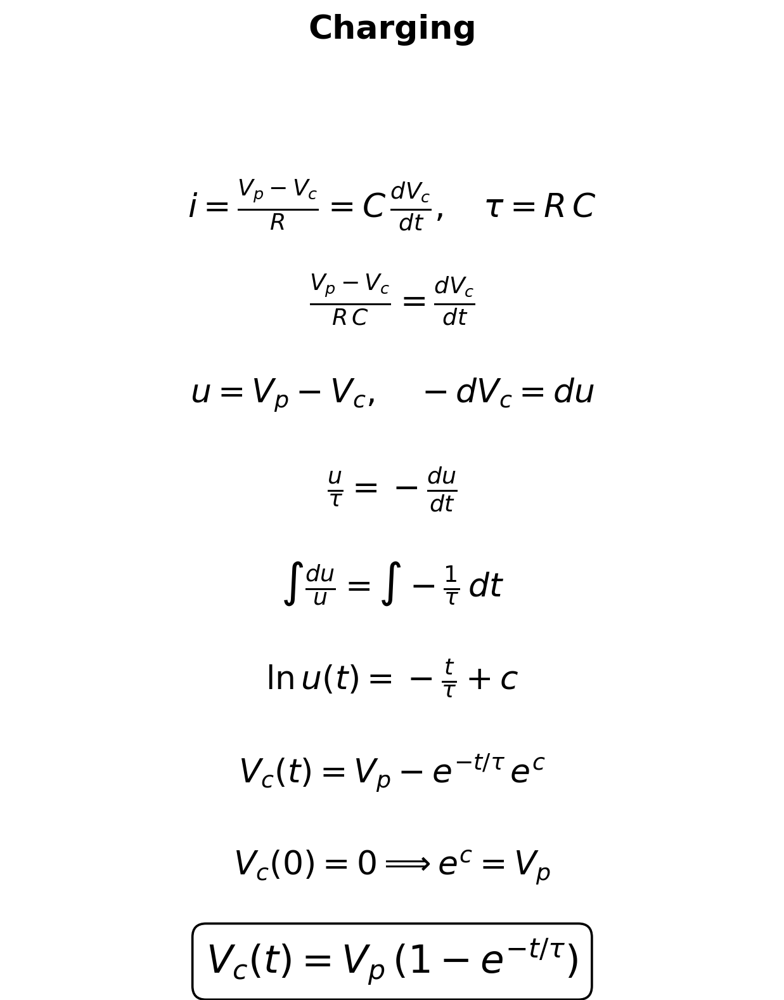
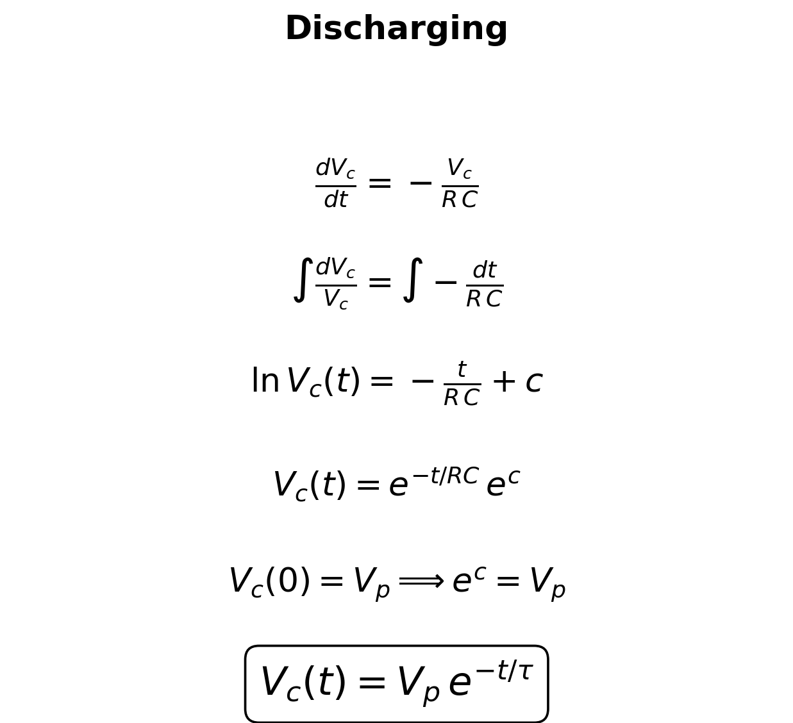
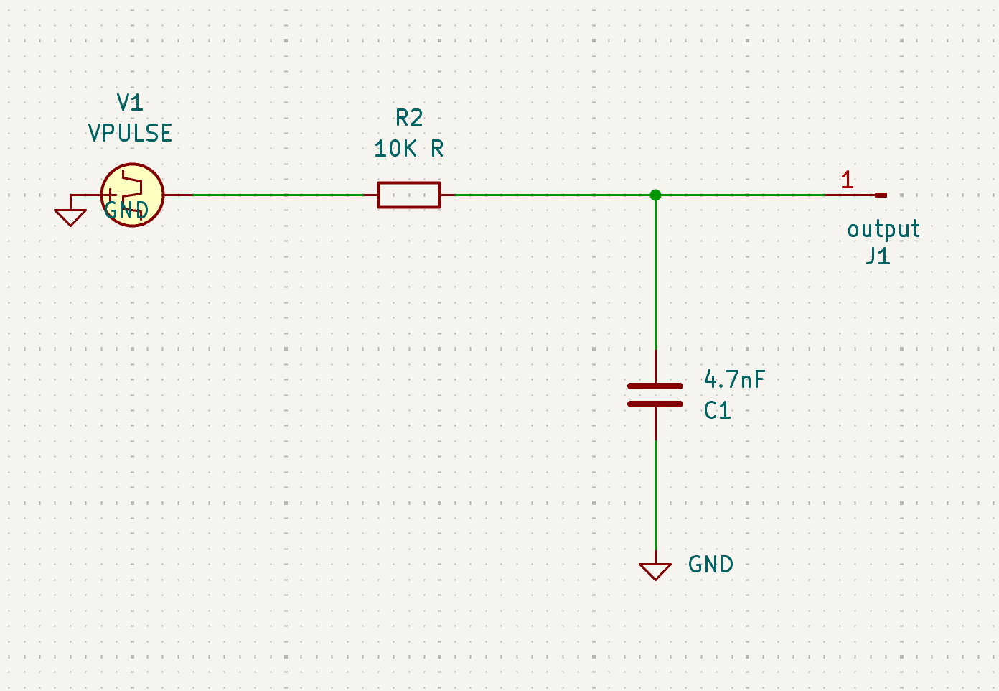
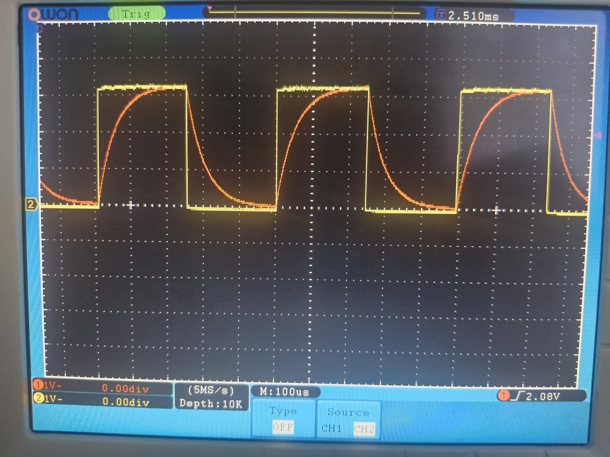
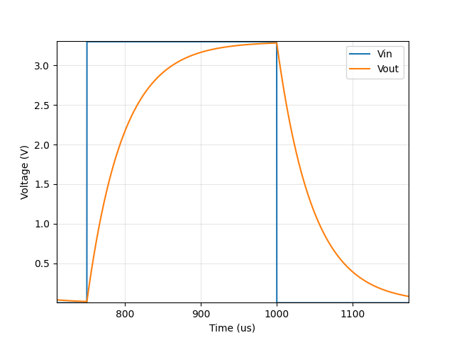
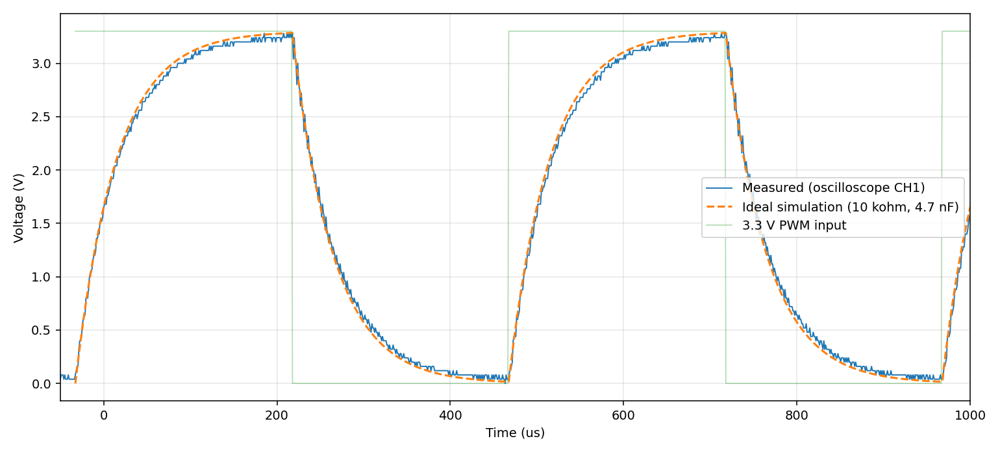

# RC Circuit Time Constant Experiment

## 1. Objective

To learn how to measure the exponential behaviour of an RC circuit, to determine the time constant `τ = RC` by two independent methods, to check whether the results agree, and to carry out an error analysis.

## 2. Theory

**PWM (pulse width modulation).** A method in which a pin is switched on and off at a fixed frequency. The duty cycle states what percentage of one period the pin is high (i.e. at `3.28 V`). Since `duty = 0.5` was chosen, the high and low intervals are equal, so the signal is a symmetric square wave. On the Pico this is done by hardware counters (the `pwmio` module), so it is unaffected by software delays and its timing comes from the crystal oscillator on the board. For this reason no separate signal generator was needed.

**Period (T) and frequency (f).** A square wave is a signal that switches abruptly between two levels (here `0 V` and `3.28 V`). The period is the duration of one full repetition; the frequency is the number of repetitions per second, measured in hertz (Hz):

$$f = \frac{1}{T}$$

For `f = 2 kHz`, `T = 500 µs` and the half period is `250 µs`. The role of the square wave in this experiment is to give the capacitor a regular "charge" and "discharge" command. Each edge starts a new charging or discharging curve, so a single measurement yields dozens of curves.

**Current (I)** is the amount of charge passing per unit time (`i = dQ/dt`), measured in amperes. **Voltage (V)** is the potential difference that drives the charges, measured in volts.

**Resistance (R).** The opposition presented to current; it dissipates energy as heat. Ohm's law is `V = I·R`, and the unit is the ohm (Ω). Its role here is to limit the current flowing into the capacitor, and thereby set the charging rate.

**Capacitance (C).** A capacitor is two plates with an insulator between them; it stores energy in an electric field rather than dissipating it. Capacitance is the charge stored per unit voltage (`Q = C·v`), measured in farads — here on the order of nanofarads (`1 nF = 10⁻⁹ F`).

Differentiating this definition with respect to time gives the relation at the heart of the experiment:

$$i = C\,\frac{dv}{dt}$$

In other words, the capacitor voltage can only change while current is flowing; it cannot jump instantaneously, because a change in zero time would require infinite current. This is why the output traces a smooth curve while the input is a square wave.

### 2.1 Current flowing through the circuit

Since the same current flows through the resistor and the capacitor in a series RC circuit, the charging and discharging equations of the circuit were derived as shown below.

 

Physical reading: while the capacitor is empty (`Vc = 0`) the current is at its maximum. From the moment the capacitor begins to charge, the difference decays exponentially. In an RC circuit the charging mathematically never ends.

Unit check: `Ω·F = s`.

**Definition of τ:** the time taken for the difference to the target to fall to `1/e ≈ 36.8 %` of its initial value. Equivalently, in charging, the time taken to reach `63.2 %` of the target.

### 2.2 Cutoff frequency

The same circuit read in the frequency domain is a low-pass filter: slow signals pass to the
capacitor, fast ones are attenuated. The turning point is the cutoff (corner) frequency, the
frequency at which the output amplitude falls to `1/√2 ≈ 70.7 %` of the input (−3 dB):

$$f_c = \frac{1}{2\pi\tau} = \frac{1}{2\pi RC}$$

With the nominal `τ = 47.00 µs` this gives `f_c = 3.39 kHz` (derived). The PWM was driven at
`f = 2 kHz`, i.e. `f/f_c = 0.59`, just below the corner — which is why the capacitor still has
time to approach the supply rail within each half period instead of settling to a small ripple.

## 3. Circuit and Components

Circuit diagram:

Nominal values:

- R = 10 kΩ
- C ≈ 4.7 nF
- τ_theoretical = R·C = **47.00 µs**

Measured values:

- R_measured = 9.78 kΩ
- C_measured = 4.9 nF
- τ_measured = 41.80 µs (cursor mode on the oscilloscope)
  τ_measured2 = 47.92 µs (with R and C measured)

## 4. Method

### 4.1 Simulation (`code_sim.py`)

Taking the component values (`R = 10 kΩ`, `C = 4.7 nF`) as inputs, the experiment was reproduced numerically:

1. A time axis covering 10 periods was built with a step of `ts = 0.05 µs`, which places about 950 samples inside one `τ`.
2. An ideal square wave `v_in` was generated to represent the PWM output of the Pico.
3. The first falling edge of `v_in` was located, and the output voltage at that instant was taken as `V₀`, the level at which the discharge begins.
4. A first degree polynomial was fitted to the values `y = ln(v/V₀)`, and the time constant was recovered from the slope as `τ = −1/m`.

### 4.2 Oscilloscope

The circuit was first connected to the oscilloscope. Using cursor mode, `τ` and the peak PWM voltage were measured and the trace was recorded. The trace was almost identical to the one expected from the simulation.

The figure shows the PWM square wave together with the capacitor being charged and discharged by it at a PWM frequency of 2 kHz.

At the 100 µs/div timebase the two traces do indeed almost coincide.

###

Since we then wanted to feed our own data into `code_sim.py` and test it, the data of that measurement was pulled from the oscilloscope over LAN and processed in `sim_measured.py`. (Since the data coming from the oscilloscope are raw ADC codes, the `3.28 V` peak measured earlier in cursor mode was taken as the reference and the scaling factor was derived from it.)

This is a comparison of the voltage data taken from the oscilloscope and converted by ourselves against the simulated trace and its values. The plot is produced by `sim_measured.py`.

## 5. Results

| Method | τ | f_c = 1/(2πτ) | Difference from R·C |
|---|---|---|---|
| Theoretical (R·C) | 47.00 µs | 3.39 kHz | — |
| Simulation (log-fit) | 47.00 µs | 3.39 kHz | ~0 % |
| Oscilloscope, cursor mode CH1/X | 41.80 µs | 3.81 kHz | −11.1 % |
| Oscilloscope, data analysis CH1/X | 49.96 µs | 3.19 kHz | +6.30 % |

## 6. Discussion / Error Analysis

As a source of error, I know that the resistor and the capacitor themselves have a tolerance of about 10 %. My cursor-mode reading on the oscilloscope, deviations included, is probably very nearly correct. The data-analysis part appears close to the true value, deviating by `|+%6,3%|`, even though it carries an error margin coming from noise and from the scaling — but this is probably only a coincidence.

## 7. Conclusion

- τ was confirmed to be in the region of 41–48 µs by two independent methods (simulation and oscilloscope).

The aim of the experiment, finding the time constant `τ`, was achieved. I completed my measurements within a reasonable margin of error, and my simulation and oscilloscope measurements are consistent with each other.
